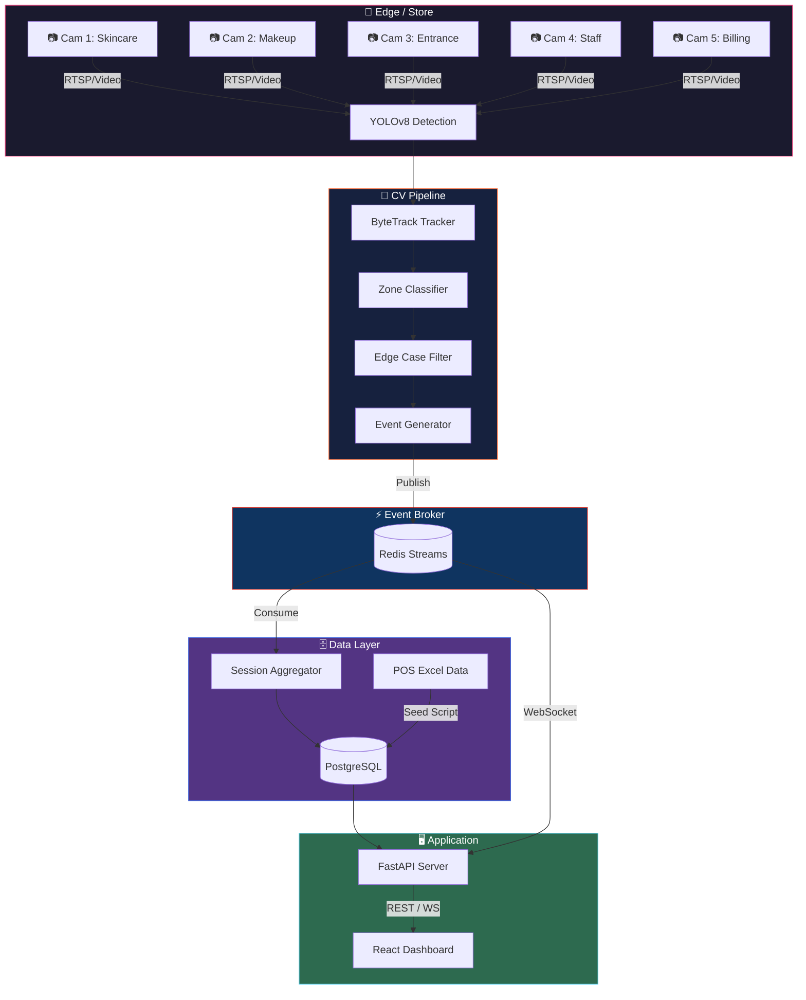

<div align="center">

<!-- Banner SVG -->


<br/><br/>


<br/><br/>

# Purplle Store Intelligence System 🏪

**A high-performance, AI-powered store intelligence platform for the Purplle Tech Challenge 2026.**  
Ingests multi-camera CCTV footage + POS sales data → real-time footfall analytics, conversion funnels, zone engagement heatmaps, and staff efficiency scoring.

</div>

---

## ✨ Key Features

| Feature | Details |
|---|---|
| 🎥 **Real-time CV Pipeline** | YOLOv8 + ByteTrack running on 5 concurrent RTSP camera feeds |
| 🗺️ **Semantic Zone Mapping** | Projects X/Y pixel coords → business zones (Skincare, Makeup, Billing, Entrance) |
| ⚡ **High-Throughput Events** | Redis Pub/Sub decouples GPU inference from DB writes for zero-blocking |
| 📡 **Rich Analytics API** | FastAPI delivering KPIs, conversion funnels, spatial heatmaps, anomalies |
| 🖥️ **Interactive Dashboard** | Glassmorphism React+Vite frontend with Recharts & live WebSocket stream |
| 🧠 **Edge Case Handling** | Staff deduplication, shopping group detection, child demographics heuristics |

---

## 🏗️ System Architecture

```
╔══════════════════════════════════════════════════════════════════════╗
║                         PURPLLE STORE INTELLIGENCE                   ║
╠══════════════════════════════════════════════════════════════════════╣
║                                                                      ║
║  ┌─────────────┐   ┌──────────────────────┐   ┌──────────────────┐  ║
║  │  CCTV Feeds │   │   CV Pipeline         │   │  Event Broker    │  ║
║  │             │   │                      │   │                  │  ║
║  │  Cam 1 ─────┼──▶│  YOLOv8 Detection    │   │  ┌────────────┐  │  ║
║  │  Skincare   │   │         │            │   │  │   Redis    │  │  ║
║  │  Cam 2 ─────┼──▶│  ByteTrack ──────────┼──▶│  │  Streams   │  │  ║
║  │  Makeup     │   │  Tracking            │   │  └────────────┘  │  ║
║  │  Cam 3 ─────┼──▶│         │            │   │                  │  ║
║  │  Entrance   │   │  Zone Classifier     │   └────────┬─────────┘  ║
║  │  Cam 4 ─────┼──▶│         │            │            │            ║
║  │  Staff      │   │  Edge Case Filter    │            │            ║
║  │  Cam 5 ─────┼──▶│         │            │            │            ║
║  │  Billing    │   │  Event Generator     │            │            ║
║  └─────────────┘   └──────────────────────┘            │            ║
║                                                         ▼            ║
║  ┌─────────────┐   ┌──────────────────────┐   ┌──────────────────┐  ║
║  │  POS Data   │   │  Data Layer          │   │  Application     │  ║
║  │  (Excel)    │   │                      │   │                  │  ║
║  │     │       │   │  ┌────────────────┐  │   │  ┌────────────┐  │  ║
║  │     └───────┼──▶│  │  PostgreSQL    │  │──▶│  │  FastAPI   │  │  ║
║  │  Seed Script│   │  │  Sessions DB   │  │   │  │  REST + WS │  │  ║
║  └─────────────┘   │  └────────────────┘  │   │  └─────┬──────┘  │  ║
║                    └──────────────────────┘   │        │         │  ║
║                                               │  ┌─────▼──────┐  │  ║
║                                               │  │  React     │  │  ║
║                                               │  │  Dashboard │  │  ║
║                                               │  └────────────┘  │  ║
║                                               └──────────────────┘  ║
╚══════════════════════════════════════════════════════════════════════╝
```

### Data Flow

```
Video Feed  →  YOLO Pipeline  →  Redis Stream  →  Session Aggregator
                                                          │
                                                    PostgreSQL
                                                          │
                                                     FastAPI  →  React Dashboard
```

### Architecture Diagram (Mermaid)



---

## 🚀 Quick Start

### Prerequisites

- **Docker** & **Docker Compose** v2.0+
- **Node.js** 22+ *(for local UI development)*
- **Python** 3.10+ *(for local API development)*
- **GPU** recommended for CV pipeline *(CPU fallback supported)*

### 🐳 Run with Docker Compose (Recommended)

```bash
# 1. Clone the repository
git clone https://github.com/DevChiniwala/purplle-store-intelligence.git
cd purplle-store-intelligence

# 2. Extract your CCTV footage
mkdir -p data/videos/
# Place your footage in: data/videos/CCTV Footage/

# 3. Spin up the full stack
docker-compose up -d --build

# 4. Check service health
docker-compose ps
```

| Service | URL | Description |
|---|---|---|
| 🖥️ Dashboard | http://localhost:5173 | React UI |
| 📡 API Docs | http://localhost:8000/docs | Swagger / OpenAPI |
| 🔌 WebSocket | ws://localhost:8000/ws/events | Live event stream |

### 🔧 Local Development

**Backend (FastAPI)**
```bash
cd api
pip install -r ../requirements-api.txt
uvicorn main:app --reload --host 0.0.0.0 --port 8000
```

**Frontend (React + Vite)**
```bash
cd dashboard
npm install
npm run dev
```

**CV Pipeline**
```bash
cd pipeline
pip install -r ../requirements-pipeline.txt
python main.py --video-dir ../data/videos/
```

---

## 📊 API Reference

### Base URL: `http://localhost:8000`

| Endpoint | Method | Description | Auth |
|---|---|---|---|
| `/api/v1/health` | `GET` | System health & component status | — |
| `/api/v1/stores/{store_id}/metrics` | `GET` | Core KPIs: Footfall, Revenue, Conversion Rate | — |
| `/api/v1/stores/{store_id}/funnel` | `GET` | 5-stage conversion funnel analysis | — |
| `/api/v1/stores/{store_id}/heatmap` | `GET` | Zone engagement scores & dwell times | — |
| `/api/v1/stores/{store_id}/anomalies` | `GET` | Detected anomalies (loitering, spikes, etc.) | — |
| `/api/v1/events` | `GET` | Paginated raw event log | — |
| `/ws/events` | `WS` | Real-time WebSocket event stream | — |

### Example Response — `/api/v1/stores/1/metrics`

```json
{
  "store_id": 1,
  "period": "2026-05-30",
  "footfall": {
    "total": 312,
    "unique_visitors": 287,
    "staff_excluded": 25
  },
  "conversion": {
    "rate": 0.34,
    "transactions": 97,
    "avg_basket": 1842.50
  },
  "zones": {
    "skincare": { "visitors": 198, "avg_dwell_seconds": 142 },
    "makeup": { "visitors": 176, "avg_dwell_seconds": 89 },
    "billing": { "visitors": 97, "avg_dwell_seconds": 67 }
  }
}
```

### WebSocket Event Schema

```json
{
  "event_type": "ZONE_ENTERED",
  "track_id": "TRK-4829",
  "zone": "skincare",
  "timestamp": "2026-05-30T14:23:11.842Z",
  "confidence": 0.94,
  "is_staff": false
}
```

---

## 📁 Project Structure

```
purplle-store-intelligence/
│
├── api/                          # FastAPI backend
│   ├── main.py                   # App entrypoint & router registration
│   ├── routers/
│   │   ├── metrics.py            # KPI aggregation endpoints
│   │   ├── funnel.py             # Conversion funnel queries
│   │   ├── heatmap.py            # Zone dwell/engagement
│   │   ├── anomalies.py          # Anomaly detection logic
│   │   └── events.py             # Paginated event log + WebSocket
│   ├── models/                   # SQLAlchemy ORM models
│   └── db.py                     # PostgreSQL connection pool
│
├── config/
│   ├── system.yaml               # Service config (ports, DB URLs, Redis)
│   └── cameras.yaml              # Zone polygon definitions per camera
│
├── dashboard/                    # React + Vite frontend
│   ├── src/
│   │   ├── components/           # Reusable UI components
│   │   ├── pages/                # Dashboard, Heatmap, Funnel views
│   │   └── hooks/                # WebSocket + data-fetching hooks
│   ├── public/
│   └── vite.config.js
│
├── events/                       # Redis Pub/Sub schemas & workers
│   ├── schemas.py                # Pydantic event models
│   └── consumer.py               # Session aggregator (Redis → PostgreSQL)
│
├── pipeline/                     # YOLOv8 + ByteTrack CV pipeline
│   ├── main.py                   # Pipeline orchestrator
│   ├── detector.py               # YOLOv8 wrapper
│   ├── tracker.py                # ByteTrack integration
│   ├── zone_classifier.py        # Polygon-based zone assignment
│   └── edge_cases.py             # Staff filter, group detection
│
├── scripts/
│   ├── setup_db.py               # PostgreSQL schema initialisation
│   └── seed_pos.py               # POS Excel → DB seeder
│
├── tests/                        # Pytest suite
│   ├── test_api.py
│   ├── test_pipeline.py
│   └── test_zone_classifier.py
│
├── data/
│   └── videos/                   # CCTV footage directory (gitignored)
│
├── Dockerfile.api
├── Dockerfile.dashboard
├── Dockerfile.pipeline
├── docker-compose.yml
├── requirements-api.txt
├── requirements-pipeline.txt
├── DESIGN.md
├── CHOICES.md
└── README.md
```

---

## 🧠 Technical Deep-Dive

### CV Pipeline

```
Frame Input
    │
    ▼
YOLOv8 (person detection, confidence > 0.5)
    │
    ▼
ByteTrack (assigns persistent Track IDs across frames)
    │
    ▼
Zone Classifier (bounding box centroid → camera polygon → semantic zone)
    │
    ▼
Edge Case Filter:
    ├── Staff Filter   → lingering in staff-only zones, uniform heuristics
    ├── Group Detector → overlapping bboxes → single shopping group entity
    └── Child Filter   → bounding box height ratio heuristic
    │
    ▼
Event Generator → publishes to Redis Stream
```

### Zone Configuration

Zones are defined as pixel-space polygons in `config/cameras.yaml`:

```yaml
cameras:
  - id: cam_01
    name: "Skincare Section"
    zones:
      skincare_main:
        polygon: [[120, 80], [480, 80], [480, 400], [120, 400]]
      skincare_premium:
        polygon: [[490, 80], [720, 80], [720, 400], [490, 400]]
  - id: cam_05
    name: "Billing Counter"
    zones:
      billing:
        polygon: [[50, 200], [700, 200], [700, 480], [50, 480]]
```

### Conversion Funnel (5-Stage)

```
Stage 1: Passerby      → Detected outside store entrance
Stage 2: Entered       → Crossed entrance threshold
Stage 3: Engaged       → Dwell time > 30s in any product zone
Stage 4: Intent        → Visited 2+ product zones or Billing approach
Stage 5: Converted     → Billing zone dwell + matched POS transaction
```

### Redis Event Stream Schema

```
Stream Key: store_events

Fields:
  event_type   : PERSON_ENTERED | ZONE_ENTERED | ZONE_EXITED | PERSON_EXITED
  track_id     : str   (ByteTrack persistent ID)
  camera_id    : str
  zone         : str   (semantic zone name)
  x, y         : float (normalised bounding box centroid)
  timestamp    : ISO 8601
  is_staff     : bool
  group_id     : str | null
```

---

## 🧪 Running Tests

```bash
# Install test dependencies
pip install -r requirements-api.txt pytest pytest-asyncio httpx

# Run full test suite
pytest tests/ -v

# Run with coverage
pytest tests/ --cov=api --cov=pipeline --cov-report=html
```

Tests cover:
- API endpoint response schemas and status codes
- Zone classifier geometry (polygon intersection edge cases)
- Staff deduplication logic
- Redis consumer session aggregation
- POS transaction matching

---

## 🐳 Docker Services

```yaml
# docker-compose.yml overview

services:
  postgres:    # PostgreSQL 15 — persistent sessions & POS data
  redis:       # Redis 7 — event stream broker
  api:         # FastAPI — REST + WebSocket analytics server
  pipeline:    # YOLOv8+ByteTrack CV service (GPU passthrough if available)
  dashboard:   # React+Vite — served via Vite dev server / Nginx
```

To watch logs for a specific service:
```bash
docker-compose logs -f api
docker-compose logs -f pipeline
```

To rebuild a single service after changes:
```bash
docker-compose up -d --build api
```

---

## 📐 Design Decisions

See [`DESIGN.md`](./DESIGN.md) for full architecture rationale and [`CHOICES.md`](./CHOICES.md) for key trade-off discussions, including:

- Why **Redis Streams** over Kafka for this scale
- Why **ByteTrack** over DeepSORT
- PostgreSQL schema design for high-cardinality session data
- Heuristic approaches for staff filtering without ML classification
- POS matching strategy (probabilistic timestamp correlation)

---

## 🤝 Contributing

This project was built for the **Purplle Tech Challenge 2026 Round 2**. If you'd like to extend it:

1. Fork the repository
2. Create a feature branch: `git checkout -b feat/your-feature`
3. Commit changes: `git commit -m 'feat: add your feature'`
4. Push: `git push origin feat/your-feature`
5. Open a Pull Request

---

<div align="center">

**Built with ❤️ for the Purplle Tech Challenge 2026 · Round 2**

[](https://github.com/DevChiniwala)

</div>
