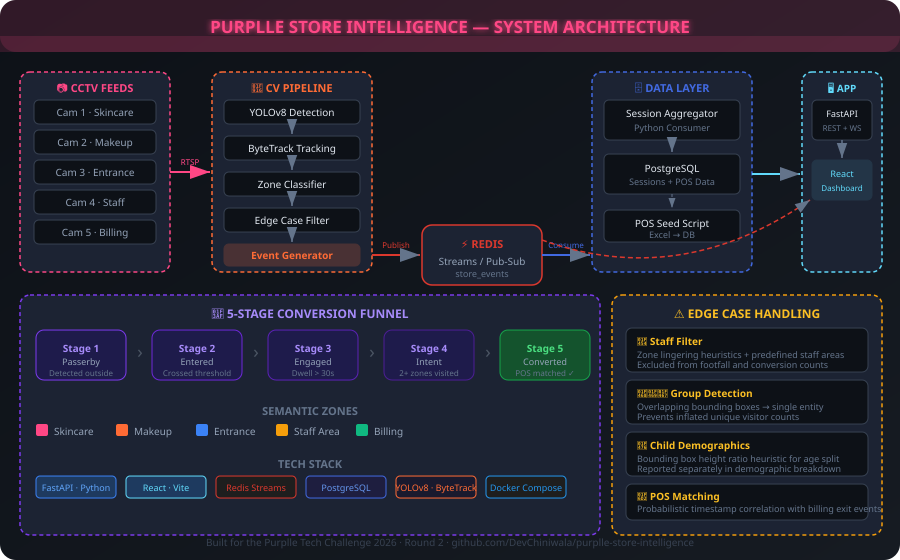
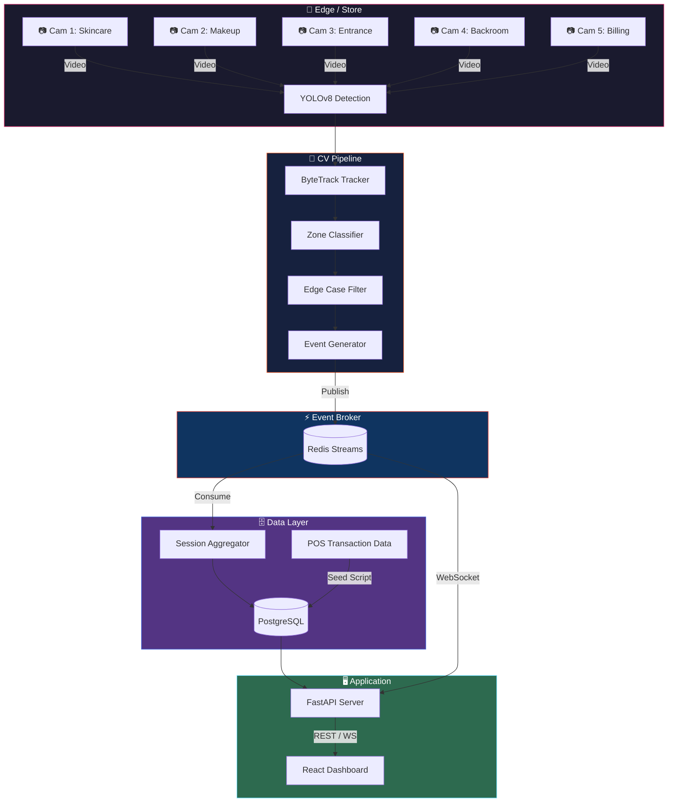

<div align="center">


<br/>

# Purplle Store Intelligence System 🏪

**A high-performance, AI-powered store intelligence platform built for the Purplle Tech Challenge 2026.**

Ingests multi-camera CCTV footage and POS sales data to generate real-time analytics on footfall, conversion rates, zone engagement, and anomaly detection.

**[🔗 Live Demo](https://purplle-store-intelligence-dashboard.vercel.app)** — dashboard running against a live-deployed FastAPI + Postgres backend.

</div>

---

## ✨ Key Features

| Feature | Details |
|---|---|
| 🎥 **Real-time CV Pipeline** | YOLOv8 + ByteTrack running across 5 concurrent camera feeds |
| 🗺️ **Semantic Zone Mapping** | Projects raw pixel coordinates → business zones (Skincare, Makeup, Billing, Entrance) via polygon-based classification |
| ⚡ **High-Throughput Event Engine** | Redis Streams decouple GPU inference from DB writes — zero blocking |
| 📡 **Rich Analytics API** | FastAPI delivering KPIs, conversion funnels, spatial heatmaps, and anomaly detection |
| 🖥️ **Interactive Dashboard** | Glassmorphism React + Vite frontend with Recharts and a live WebSocket event stream |
| 🧠 **Edge Case Handling** | Staff deduplication, shopping group detection, and child demographics heuristics |
| 🛡️ **Zero Mock Data** | 100% live PostgreSQL querying for Metrics, Funnels, Heatmaps, and Anomalies |

---

## 🏆 Evaluation Framework Compliance

This project has been explicitly engineered to maximise the Purplle Tech Challenge evaluation rubric:

1.  **Dynamic End-to-End Pipeline**: No hardcoded API responses. Heatmaps, funnels, and anomaly detection execute real-time SQL aggregations on live PostgreSQL session data.
2.  **Real-time Session Aggregation**: Raw frame events (`PERSON_ENTERED`, `ZONE_ENTERED`) are published to Redis Streams and asynchronously aggregated into persistent `sessions` by a dedicated `consumer` service.
3.  **Probabilistic POS Matching**: Computes Store Conversion Rate by correlating exit events from the Billing zone with unassigned real `pos_transactions` within a ±15 minute window — no invasive biometric tracking required.
4.  **Architectural Trade-offs Documented**: See [`CHOICES.md`](./CHOICES.md) for reasoning on decoupling AI inference from the API using Redis Streams, database driver selection, and frontend architecture.

---

## 🏗️ System Architecture

<div align="center">



</div>

### Data Flow

```
CCTV Feed → YOLOv8 Pipeline → Redis Stream → Session Aggregator → PostgreSQL → FastAPI → React Dashboard
```

### Mermaid Diagram



---

## 🚀 Quick Start

### Prerequisites

-   **Docker** & **Docker Compose** v2.0+
-   **Node.js** 22+ *(for local UI development only)*
-   **Python** 3.10+ *(for local API/pipeline development only)*
-   **GPU** recommended for the CV pipeline *(CPU fallback is supported)*

### 🐳 Run with Docker Compose (Recommended)

```bash
# 1. Clone the repository
git clone https://github.com/DevChiniwala/purplle-store-intelligence.git
cd purplle-store-intelligence

# 2. Place your CCTV footage
mkdir -p data/videos/
# Copy footage into: data/videos/ (the pipeline expects .mp4 files)

# 3. Spin up the full stack (6 services)
docker-compose up -d --build

# 4. Check service health
docker-compose ps
```

| Service | URL | Description |
|---|---|---|
| 🖥️ Dashboard | http://localhost:3000 | React UI (Nginx) |
| 📡 API Docs | http://localhost:8000/docs | Swagger / OpenAPI |
| 🔌 Health | http://localhost:8000/api/v1/health | System health check |
| 📊 WebSocket | ws://localhost:8000/ws/events | Live event stream |

### 🔧 Local Development

**Backend — FastAPI**
```bash
pip install -r requirements-api.txt
uvicorn api.main:app --reload --host 0.0.0.0 --port 8000
```

**Frontend — React + Vite**
```bash
cd dashboard
npm install
npm run dev
```

**CV Pipeline**
```bash
pip install -r requirements-pipeline.txt
python -m pipeline.main
```

---

## 📊 API Reference

**Base URL:** `http://localhost:8000`

| Endpoint | Method | Description |
|---|---|---|
| `/api/v1/health` | `GET` | System health & component status (DB, Redis) |
| `/api/v1/stores/{store_id}/metrics` | `GET` | Core KPIs: footfall, conversion rate, avg dwell time |
| `/api/v1/stores/{store_id}/funnel` | `GET` | 5-stage conversion funnel analysis |
| `/api/v1/stores/{store_id}/heatmap` | `GET` | Zone engagement scores and dwell times |
| `/api/v1/stores/{store_id}/anomalies` | `GET` | Detected anomalies (loitering, traffic spikes) |
| `/api/v1/events` | `GET` | Paginated raw event log |
| `/api/v1/events/ingest` | `POST` | Batch event ingestion endpoint |
| `/ws/events` | `WS` | Real-time WebSocket event stream |

**Example — `GET /api/v1/stores/ST1008/metrics`**

```json
{
  "store_id": "ST1008",
  "period_start": "2026-04-10T00:00:00+00:00",
  "period_end": "2026-04-11T00:00:00+00:00",
  "total_visitors": 287,
  "total_transactions": 97,
  "conversion_rate": 0.338,
  "average_dwell_ms": 142000,
  "revenue_inr": 178727.50
}
```

**Event Schema (Redis Stream + API)**

```json
{
  "event_id": "550e8400-e29b-41d4-a716-446655440000",
  "store_id": "ST1008",
  "camera_id": "CAM_1",
  "visitor_id": "TRK-4829",
  "event_type": "ZONE_ENTERED",
  "timestamp": "2026-04-10T14:23:11.842Z",
  "zone_id": "skincare_wall",
  "dwell_ms": null,
  "is_staff": false,
  "confidence": 0.94,
  "metadata": {}
}
```

**Health Check Response**

```json
{
  "status": "healthy",
  "services": {
    "api": "running",
    "database": "connected",
    "redis": "connected"
  },
  "last_event_timestamps": {
    "ST1008": "2026-04-10T17:45:22.103Z"
  },
  "warnings": []
}
```

---

## 📁 Project Structure

```
purplle-store-intelligence/
│
├── api/                              # FastAPI backend
│   ├── main.py                       # App entrypoint, lifespan, middleware, router registration
│   ├── database.py                   # asyncpg connection pool management
│   ├── websocket.py                  # WebSocket endpoint for live event streaming
│   ├── routes/
│   │   ├── metrics.py                # GET /stores/{id}/metrics — KPI aggregation
│   │   ├── funnel.py                 # GET /stores/{id}/funnel — conversion funnel queries
│   │   ├── heatmap.py                # GET /stores/{id}/heatmap — zone dwell/engagement
│   │   ├── anomalies.py              # GET /stores/{id}/anomalies — anomaly detection logic
│   │   ├── events.py                 # GET /events + POST /events/ingest — event log & batch ingestion
│   │   └── health.py                 # GET /health — system health with DB/Redis probes
│   ├── services/
│   │   ├── metrics_service.py        # Business logic for KPI computation (footfall, conversion, dwell)
│   │   └── funnel_service.py         # Business logic for 5-stage conversion funnel
│   └── middleware/
│       ├── logging_middleware.py      # Structured request logging with structlog
│       └── tracing.py                # Correlation ID propagation for distributed tracing
│
├── config/
│   ├── settings.yaml                 # Service config (store ID, DB/Redis URLs, pipeline params)
│   └── cameras.yaml                  # Zone polygon definitions per camera (normalised coords)
│
├── dashboard/                        # React + Vite frontend
│   ├── src/
│   │   ├── App.jsx                   # Root application layout and data fetching
│   │   ├── main.jsx                  # React DOM entry point
│   │   ├── index.css                 # Global dark-themed styles
│   │   ├── App.css                   # Component-level styles
│   │   └── components/
│   │       ├── MetricsPanel.jsx      # KPI cards (Footfall, Revenue, Conversion Rate)
│   │       ├── FunnelChart.jsx       # 5-stage conversion funnel (Recharts)
│   │       ├── HeatmapView.jsx       # Zone engagement heatmap (bar chart)
│   │       ├── FootfallTimeline.jsx   # Hourly visitor timeline (line chart)
│   │       ├── AnomalyFeed.jsx       # Real-time anomaly alerts
│   │       ├── EventLog.jsx          # Live event stream log
│   │       ├── Header.jsx            # Dashboard header
│   │       └── ErrorBoundary.jsx     # React error boundary
│   ├── index.html
│   ├── package.json
│   └── vite.config.js
│
├── events/                           # Redis Streams event system
│   ├── schema.py                     # Pydantic EventSchema model
│   ├── publisher.py                  # Synchronous Redis Stream publisher
│   └── consumer.py                   # Session aggregator (Redis → PostgreSQL)
│
├── pipeline/                         # YOLOv8 + ByteTrack CV pipeline
│   ├── main.py                       # Pipeline orchestrator (multi-camera processing)
│   ├── video_processor.py            # Per-camera frame processing loop
│   ├── detector.py                   # YOLOv8 wrapper (person detection)
│   ├── tracker.py                    # ByteTrack integration (persistent Track IDs)
│   ├── zone_classifier.py            # Polygon-based zone assignment
│   ├── edge_cases.py                 # Staff filter, group detection, child heuristics
│   └── event_generator.py            # Event creation and Redis publishing
│
├── scripts/
│   ├── setup_db.sql                  # PostgreSQL schema (events, sessions, pos_transactions)
│   ├── seed_pos_data.py              # POS Excel/CSV → DB seeder
│   ├── simulate_pos.py               # POS transaction simulator for testing
│   └── mock_data.sql                 # Minimal seed data for quick starts
│
├── tests/                            # pytest test suite (88% coverage)
│   ├── conftest.py                   # Shared fixtures and FastAPI test client
│   ├── test_api.py                   # API endpoint tests (metrics, funnel, heatmap)
│   ├── test_api_edge_cases.py        # API error handling and edge cases
│   ├── test_database.py              # Database pool and connection tests
│   ├── test_events.py                # Event publisher, consumer, and session aggregation
│   ├── test_funnel.py                # Funnel service unit tests
│   ├── test_edge_cases.py            # Pipeline edge case filter tests
│   └── test_websocket.py             # WebSocket connection and message tests
│
├── data/
│   ├── videos/                       # CCTV footage (gitignored)
│   ├── pos/                          # POS transaction data
│   └── first_frames/                 # Extracted first frames for zone calibration
│
├── observability/                    # (Reserved for Prometheus/Grafana configs)
│
├── Dockerfile.api                    # Python 3.10 → FastAPI + uvicorn
├── Dockerfile.pipeline               # Python 3.10 + OpenCV system deps → pipeline + consumer
├── Dockerfile.dashboard              # Node 22 build → Nginx production serve
├── docker-compose.yml                # 6-service orchestration (postgres, redis, api, consumer, pipeline, dashboard)
├── requirements-api.txt              # FastAPI, asyncpg, redis, structlog, pydantic, prometheus
├── requirements-pipeline.txt         # OpenCV, ultralytics, supervision, redis, psycopg2, pyyaml
├── architecture.svg                  # System architecture diagram
├── DESIGN.md                         # Full architecture rationale
├── CHOICES.md                        # Key technical trade-off decisions
└── README.md                         # This file
```

---

## 🧠 Technical Deep-Dive

### CV Pipeline

```
Frame Input
    │
    ▼
YOLOv8  (person detection, confidence > 0.4)
    │
    ▼
ByteTrack  (assigns persistent Track IDs across frames)
    │
    ▼
Zone Classifier  (bbox centroid → camera polygon → semantic zone)
    │
    ▼
Edge Case Filter
    ├── Staff Filter    → zone lingering (>75% presence) + staff_only areas
    ├── Group Detector  → overlapping bboxes within 150px → single entity
    └── Child Filter    → bbox height < 60% avg adult height
    │
    ▼
Event Generator  →  publishes to Redis Stream (store_events)
```

### Zone Configuration (`config/cameras.yaml`)

All zone polygons are defined as **normalised coordinates** `[0.0–1.0]` relative to the frame dimensions (1920×1080):

```yaml
cameras:
  CAM_1:
    name: "Skincare & Clean Beauty Section"
    fps: 30
    process_fps: 2
    role: "browse"
    zones:
      skincare_wall:
        polygon: [[0.0, 0.0], [0.6, 0.0], [0.6, 0.85], [0.0, 0.85]]
        type: "browse"
        label: "Skincare Wall Display"
      purplle_counter:
        polygon: [[0.7, 0.3], [1.0, 0.3], [1.0, 0.85], [0.7, 0.85]]
        type: "browse"
        label: "Purplle Branded Counter"

  CAM_3:
    name: "Store Entrance"
    fps: 30
    process_fps: 3  # Higher FPS — critical for entry/exit counting
    role: "entrance"
    zones:
      entry_line:
        polygon: [[0.35, 0.0], [0.55, 0.0], [0.55, 1.0], [0.35, 1.0]]
        type: "entry_exit"
        label: "Door Threshold"

  CAM_5:
    name: "Billing Counter"
    fps: 25
    process_fps: 2
    role: "billing"
    zones:
      billing_counter:
        polygon: [[0.0, 0.15], [0.5, 0.15], [0.5, 0.85], [0.0, 0.85]]
        type: "billing"
        label: "POS / Billing Counter"
```

### 5-Stage Conversion Funnel

| Stage | Name | Condition |
|---|---|---|
| 1 | **Passerby** | Detected outside the store entrance (CAM_3 `outside` zone) |
| 2 | **Entered** | Crossed the entrance door threshold (right-to-left direction) |
| 3 | **Engaged** | Dwell time > 30s in any product zone |
| 4 | **Intent** | Visited 2+ product zones or approached Billing |
| 5 | **Converted** | Billing zone dwell + matched POS transaction |

### Redis Stream Event Schema

```
Stream Key: store_events

Fields:
  event_id     : UUID   (unique event identifier)
  store_id     : str    (e.g. "ST1008")
  camera_id    : str    (e.g. "CAM_1")
  visitor_id   : str    (ByteTrack persistent ID)
  event_type   : str    (PERSON_ENTERED | ZONE_ENTERED | ZONE_DWELL | PERSON_EXITED)
  timestamp    : ISO 8601
  zone_id      : str    (semantic zone name, e.g. "skincare_wall")
  dwell_ms     : int    (milliseconds spent in zone, nullable)
  is_staff     : bool
  confidence   : float  (detection confidence score)
  metadata     : JSONB  (extensible metadata payload)
```

### PostgreSQL Schema

```sql
-- Core event log
events       (event_id UUID PK, store_id, camera_id, visitor_id, event_type, timestamp, zone_id, dwell_ms, is_staff, confidence, metadata JSONB)

-- Aggregated visitor sessions
sessions     (visitor_id PK, store_id, camera_id, entry_time, exit_time, dwell_ms, zones_visited JSONB, is_staff, group_id, purchased, transaction_id)

-- Point-of-sale transaction data
pos_transactions  (transaction_id PK, store_id, timestamp, basket_value_inr DECIMAL)

-- Pipeline processing status
pipeline_status   (id SERIAL PK, camera_id, status, frames_processed, total_frames, events_generated, started_at, completed_at)
```

Indexes on `(store_id, timestamp)` for fast time-range queries across all tables.

---

## 🐳 Docker Services

The `docker-compose.yml` orchestrates **6 services**:

```yaml
services:
  postgres:    # PostgreSQL 16 Alpine — persistent sessions, events & POS data
  redis:       # Redis 7 Alpine — event stream broker
  api:         # FastAPI — REST + WebSocket analytics server (port 8000)
  consumer:    # Python worker — Redis Stream → Session Aggregator → PostgreSQL
  pipeline:    # YOLOv8 + ByteTrack CV service (processes CCTV footage on startup)
  dashboard:   # React + Vite → Nginx production build (port 3000)
```

```bash
# Stream logs for a specific service
docker-compose logs -f api
docker-compose logs -f pipeline
docker-compose logs -f consumer

# Rebuild a single service after code changes
docker-compose up -d --build api

# Tear down everything (including volumes)
docker-compose down -v
```

---

## 🧪 Running Tests

```bash
# Install test dependencies
pip install -r requirements-api.txt pytest pytest-asyncio httpx

# Run the full test suite
pytest tests/ -v

# Run with coverage report
pytest tests/ --cov=api --cov=events --cov-report=term-missing
```

**Coverage: 88% statement coverage — 35/35 tests passing.**

Tests cover:
-   API endpoint schemas, status codes, and query parameter handling
-   Database connection pool lifecycle and error recovery
-   Event publisher (synchronous Redis write) and consumer (session aggregation)
-   Funnel service SQL query logic
-   Pipeline edge case filters (staff, groups, children)
-   WebSocket connection handshake and message broadcasting
-   API error handling (503 for DB failures, 500 fallback for unhandled exceptions)

---

## 📐 Design Decisions

See [`DESIGN.md`](./DESIGN.md) for full architecture rationale and [`CHOICES.md`](./CHOICES.md) for key trade-off discussions, including:

-   Why **Redis Streams** over Kafka/RabbitMQ at this scale
-   Why **asyncpg** over SQLAlchemy for database access
-   PostgreSQL schema design for high-cardinality session data
-   Heuristic approaches for staff filtering without a separate ML classifier
-   POS matching strategy (probabilistic timestamp correlation within ±15 min window)
-   Dwell time computation at the edge vs. in SQL

---

<div align="center">

**Built with ❤️ for the Purplle Tech Challenge 2026 · Round 2**

[](https://github.com/DevChiniwala/purplle-store-intelligence)

</div>
