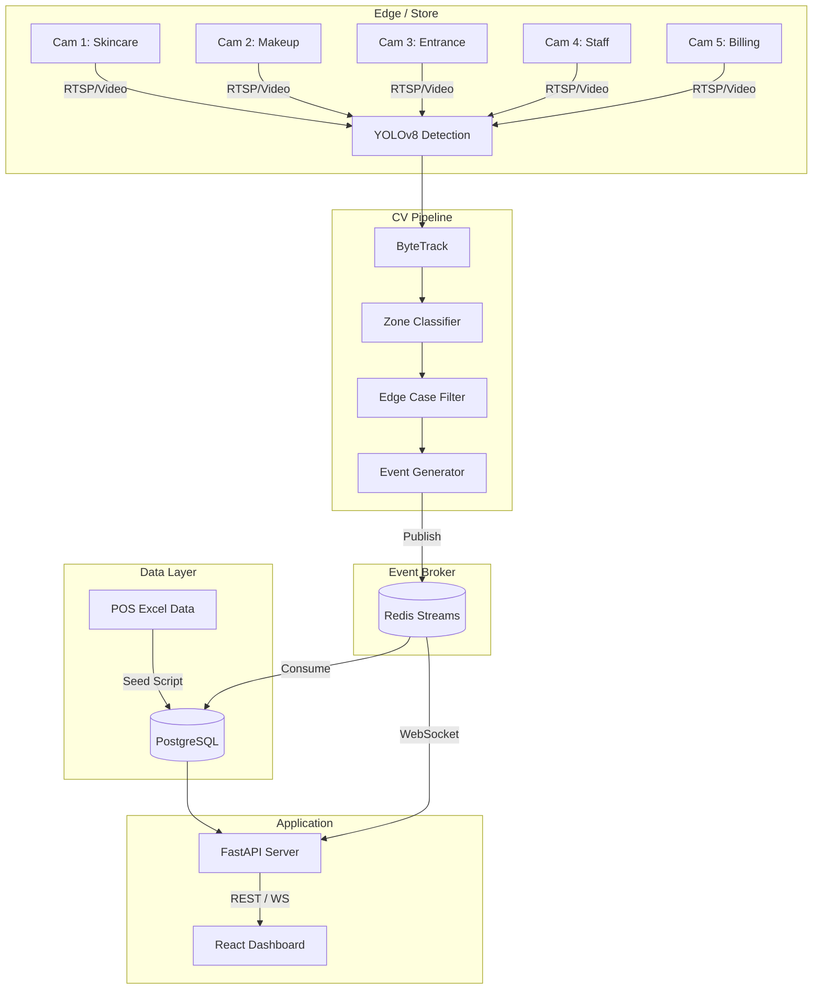

# Purplle Store Intelligence System 🏪


A high-performance, AI-powered store intelligence system designed for the **Purplle Tech Challenge 2026**. This system ingests multi-camera CCTV footage and POS sales data to generate real-time analytics on footfall, conversion rates, zone engagement, and staff efficiency.

## 🌟 Key Features

- **Real-time Computer Vision**: YOLOv8 + ByteTrack pipeline running on 5 concurrent camera feeds.
- **Semantic Zone Mapping**: Translates raw X/Y coordinates into business-meaningful zones (Skincare, Makeup, Billing, Entrance).
- **High-Throughput Event Engine**: Redis Pub/Sub architecture ensures the GPU pipeline never blocks on database writes.
- **Rich Analytics API**: FastAPI backend delivering comprehensive KPIs, conversion funnels, and spatial heatmaps.
- **Interactive Dashboard**: Modern, glassmorphism React+Vite frontend with Recharts visualization.
- **Edge Case Handling**: Staff filtering, shopping group detection, and child demographics heuristics.

## 🏗️ Architecture



## 🚀 Quick Start

### Prerequisites
- Docker and Docker Compose
- Node.js 22+ (for local UI dev)
- Python 3.10+ (for local API dev)

### Run with Docker Compose (Recommended)

1. Clone the repository
2. Extract your CCTV footage into `data/videos/CCTV Footage/`
3. Run the orchestration stack:
```bash
docker-compose up -d --build
```
4. Access the Dashboard at [http://localhost:5173](http://localhost:5173)
5. Access the API Docs at [http://localhost:8000/docs](http://localhost:8000/docs)

## 📊 API Endpoints

| Endpoint | Method | Description |
|----------|--------|-------------|
| `/api/v1/health` | GET | System health status |
| `/api/v1/stores/{store_id}/metrics` | GET | Core KPIs (Footfall, Revenue, Conversion) |
| `/api/v1/stores/{store_id}/funnel` | GET | 5-stage conversion funnel analysis |
| `/api/v1/stores/{store_id}/heatmap` | GET | Zone engagement and dwell times |
| `/api/v1/stores/{store_id}/anomalies` | GET | Detected anomalies (e.g., loitering, spikes) |
| `/api/v1/events` | GET | Paginated raw event log |
| `/ws/events` | WS | Real-time WebSocket event stream |

## 📁 Project Structure

```
purplle-store-intelligence/
├── api/                  # FastAPI backend
├── config/               # System and camera zone configurations
├── dashboard/            # React + Vite frontend
├── events/               # Redis pub/sub schemas and workers
├── pipeline/             # YOLOv8 + ByteTrack CV pipeline
├── scripts/              # DB setup and POS seeding scripts
├── tests/                # Pytest suite
└── docker-compose.yml    # Orchestration
```

---
*Built for the Purplle Tech Challenge 2026 Round 2.*
